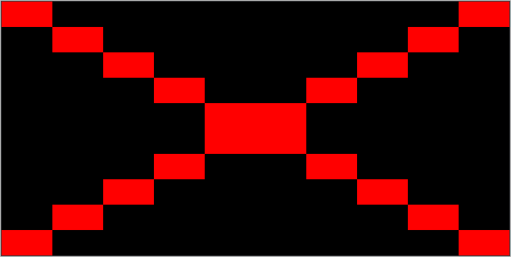

# Stage 1/6: Create an image
## Description
At this stage, you'll learn some basic image manipulation.

## Objective
Your task is to draw a black rectangle of a given size, draw two red lines crossing it and save the image. Your program should read the rectangle's width and height, as well as the output file name from the input. We will use only `.png` file format for this project.

We recommend to use `java.awt.image.BufferedImage` class to handle and manipulate the image data and `javax.imageio.ImageIO` for reading and saving images from/to a file. You can check out some nice explanations and examples of <a href="https://www.tutorialspoint.com/java_dip/java_buffered_image.htm">BufferedImage</a> and <a href="https://www.tutorialspoint.com/How-to-convert-Byte-Array-to-Image-in-java">ImageIO</a> to be more confident in what you're doing. You can also look at official documentation on <a href="https://docs.oracle.com/javase/8/docs/api/java/awt/image/BufferedImage.html">BufferedImage</a> and <a href="https://docs.oracle.com/javase/8/docs/api/javax/imageio/ImageIO.html">ImageIO</a> classes.

Tests use hash comparison of output files to test your solution. Using the proposed classes will help you avoid unintended difficulties.

## Example
The greater-than symbol followed by a space (`> `) represents the user input. Note that it's not part of the input.
```
Enter rectangle width:
> 20
Enter rectangle height:
> 10
Enter output image name:
> out.png
```
`out.png` should look like this:

