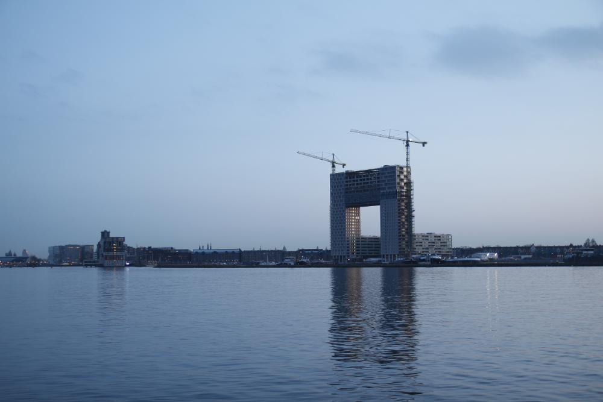
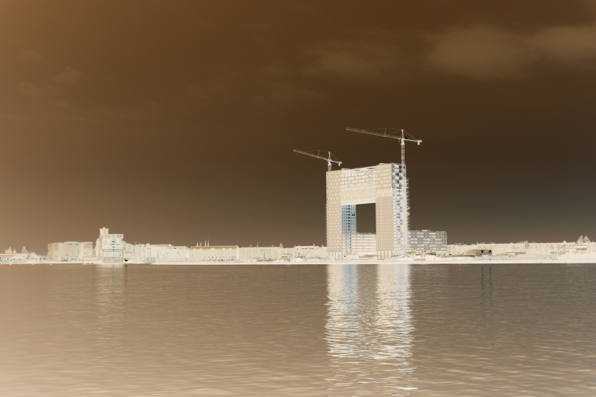

# Stage 2/6: Negative photo
## Description
Before digital photography came around, people used to work with negative images on film. Let’s get nostalgic and emulate a warm analog negative film image!

To create a negative image, you should invert all color components for every pixel. Inverted color for `(r, g, b)` is `(255 - r, 255 - g, 255 - b)`.

## Objective
At this stage, you should add command-line parameters to specify the input and output files for your program. Use parameter `-in` for the input file path and parameter `-out` for the output file path. For simplicity, we will use only `.png` file format in this project. Your program should read the specified input image file, inverse colors and save the file to a given location.

## Example
The greater-than symbol followed by a space (`> `) represents the user input. Note that it's not part of the input.
```
> java Main -in sky.png -out sky_negative.png
```
For the following `sky.png`:



`sky_negative.png` should look like this:

